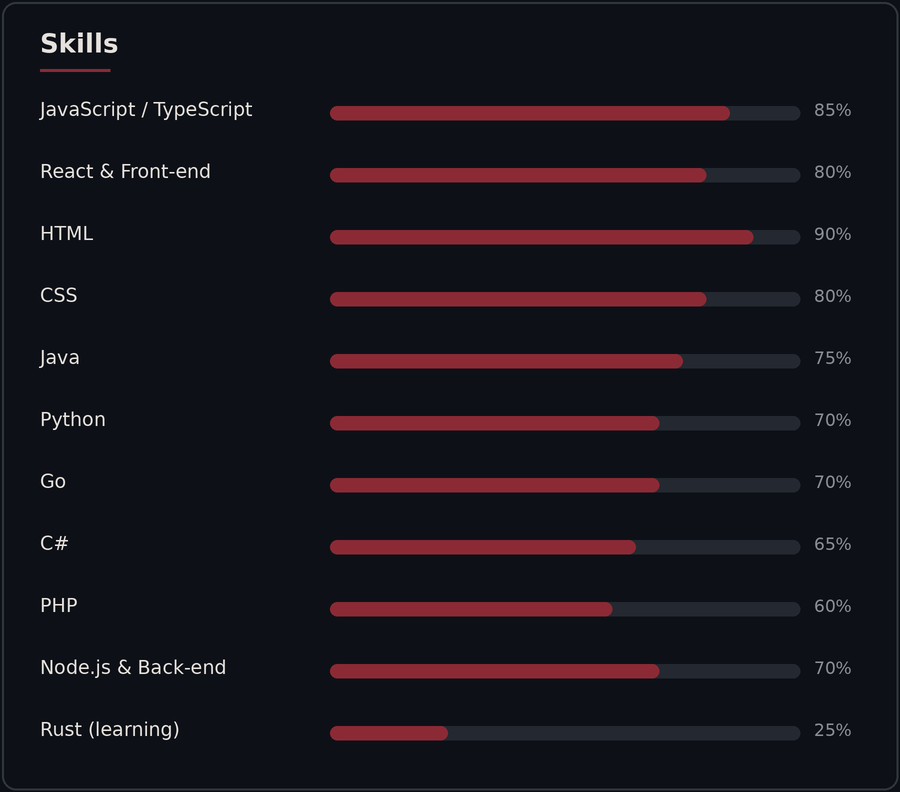
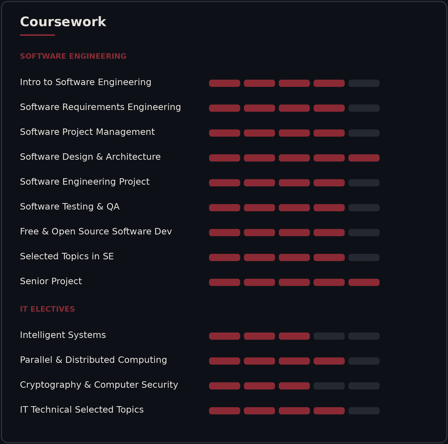

## I'm Fatema

a Full Stack Developer with a degree in Software Engineering from UOB. I enjoy building apps and starting new projects. I'm currently enrolled in Reboot01, and I'm showcasing some of its curriculum projects here alongside a few personal ones.

### Skills & Coursework

  

<!--

  

-->

### Tech Stack

### Featured Projects

#### [mini-framework (OrchidJS)](https://github.com/fatemayaqoob/mini-framework)
A JavaScript framework I built from scratch, with virtual DOM rendering, diffing, state management, and routing. It's the foundation for my Bomberman game, and the project I'm proudest of.

`JAVASCRIPT` · `FRAMEWORK DESIGN` . `HTML` . `CSS`

#### [Bomberman-DOM](https://github.com/fatemayaqoob/bomberman)
A multiplayer browser game inspired by the classic Bomberman, built on my own framework, [OrchidJS](https://github.com/fatemayaqoob/mini-framework).

`JAVASCRIPT` · `GAME DEVELOPMENT` . `SYSTEM DESIGN` . `FRAMEWORK DESIGN` 

  

  

  

#### [Boosted](https://github.com/fatemayaqoob/Boosted)
A gamified take on the 01 curriculum "Forum" project, it is a web forum where users can connect through posts, likes and comments in spcified categories.

`GO` . `SQL` . `FRONTEND` . `BACKEND` . `HTML` . `CSS` . `DOCKER`

### Currently Exploring

- Rust and systems programming
- Building new projects
- Mobile development

### Let's Connect

